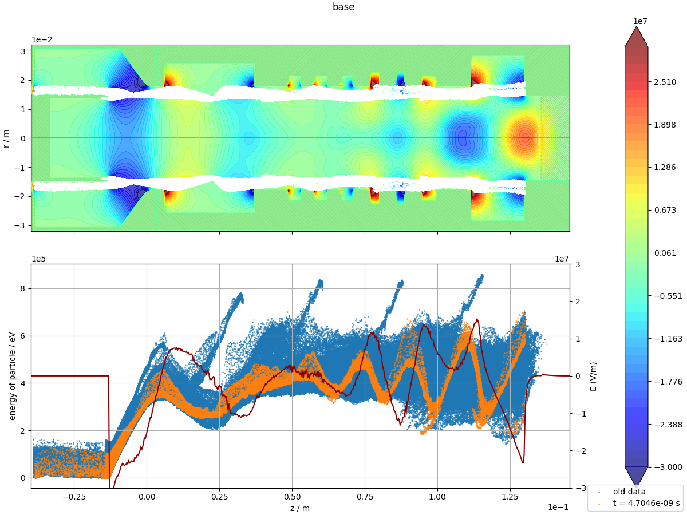
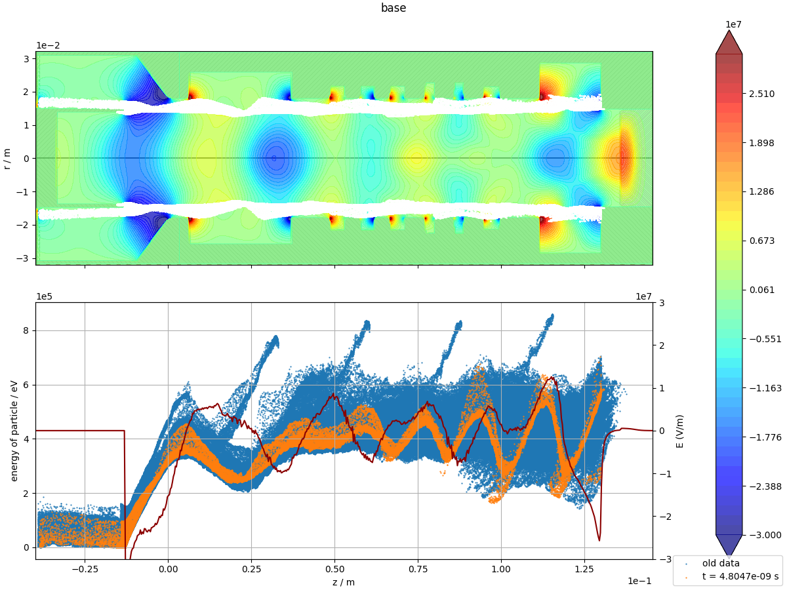
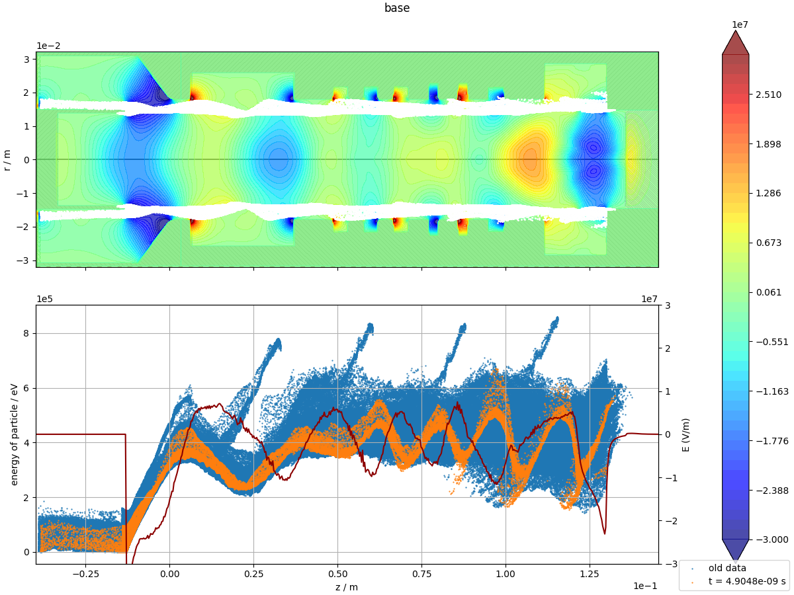
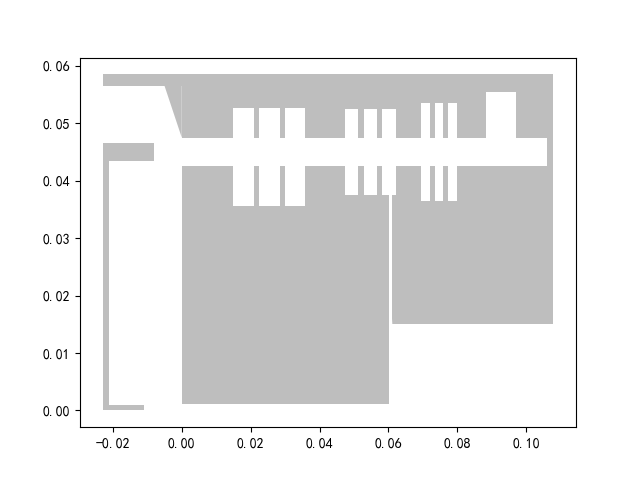
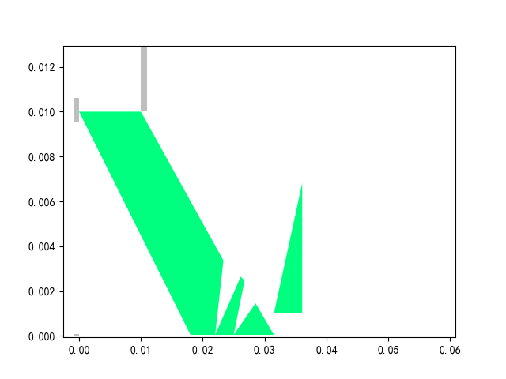

# MAGIC后处理工具
## 快速入门
不同后缀的文件用对应的parser解析即可，例如，解析par，应采用par_parser.py。

total_parser.py可以对同一.m2d文件生成的几种结果文件进行整合处理。

下面的例子展示了如何解析一个.grd文件：

```python
import grd_parser
grd = grd_parser.GRD(r'path/to/data.grd')

# How to use a GRD object
print(grd.obs.keys()) # 查看此.grd文件中包含的observe数据标题

print(grd.ranges[list(grd.ranges.keys())[0]][0]['data'] # 查看此.grd文件中包含的第0块range数据

```

更合适的使用方法是在PyCharm的控制台执行以上代码，随后可以在变量列表中查看grd对象的结构。


## 兼容性

暂时只支持Magic 2005 Single，double版本及Magic 2017版运行结果中会用1.0+12这种形式来表示浮点数1.0E+12，暂时无法解析。


## 效果展示

利用total_parser.py输出组图到指定文件夹：








paper_plot/trivial.py输出精修图：


更多数据展示方式：


（上面的示例中，几何结构通过贴图实现，须事先保存几何结构的截图）

## 绘制几何结构

```python
from geom_parser import GEOM
import matplotlib.pyplot as plt
filename = r"D:\MagicFiles\CherenkovAcc\cascade\min_case_for_gradient_test\test_diffraction-23.grd"
# filename = r"E:\GeneratorAccelerator\Genac\optmz\Genac10G50keV\粗网格\单独处理\Genac10G50keV2.grd"
geom = GEOM(filename)
plt.figure()
geom.plot(plt.gca())
```



