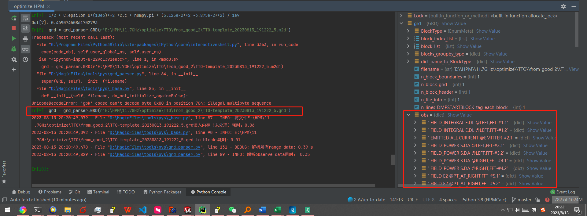

# MAGIC后处理工具
## 快速入门
不同后缀的文件用对应的parser解析即可。例如，解析par，应采用par_parser.py。

total_parser.py可以对同一.m2d文件生成的几种结果文件进行整合处理。

下面的例子展示了如何解析一个.grd文件（注意，代码中的文件路径、数据标题等字符串请根据实际情况自行替换）：

```python
import grd_parser
grd = grd_parser.GRD(r'path/to/data.grd')

# How to use a GRD object
print(grd.obs.keys()) # 查看此.grd文件中包含的observe数据标题

print(grd.ranges[list(grd.ranges.keys())[0]][0]['data'] # 查看此.grd文件中包含的第0块range数据

```

数据处理大多时候是个走一步看一步的过程。例如，很多时候我们并不知道grd对象中都有哪些数据。因此，在交互环境下执行数据处理代码非常有必要。

推荐在PyCharm的控制台执行以上代码，如下图所示。从下面截图的右侧红框部分可以看出，grd.obs是一个dict对象，其中包括`FIELD_INTEGRAL ...` 等一系列key（即，前文提到的`数据标题`）。



## 兼容性

暂时只支持Magic 2005 Single。

double版本及Magic 2017版运行结果中会用1.0+12这种形式来表示浮点数1.0E+12，暂时无法解析。


## 效果展示

### 输出组图到指定文件夹
相关代码见 [此文件](total_parser_2.py)。


paper_plot/trivial.py输出精修图：


更多数据展示方式：


### 绘制几何结构
最简代码：

```python
from geom_parser import GEOM
import matplotlib.pyplot as plt
# 文件名后缀无所谓，但必须要有
filename = r"D:\MagicFiles\CherenkovAcc\cascade\min_case_for_gradient_test\test_diffraction-23.grd"
geom = GEOM(filename)
plt.figure()
geom.plot(plt.gca())
```


下面的代码段显示了如何将粒子与几何结构绘制在一张图上：
```python
plt.figure()
geom.plot(plt.gca())
plt.scatter(*par.phasespaces[' ALL PARTICLES @AXES(X1,X2)-#1 $$$PLANE_X1_AND_X2_AT_X0=  0.000'][-5]['data'].values.T,s = 0.0001,c ='r')
```

